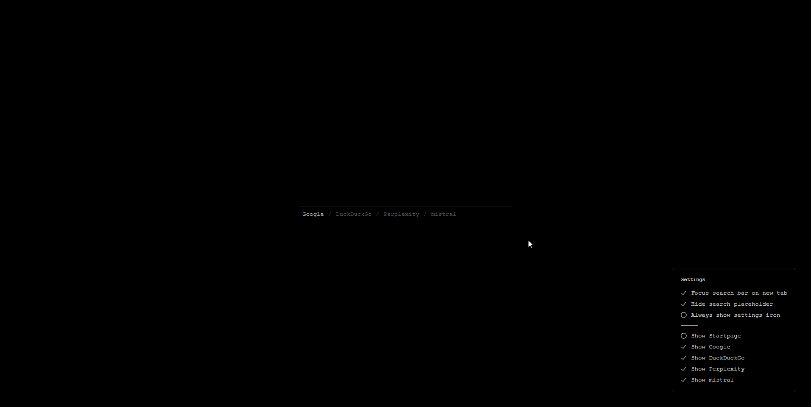
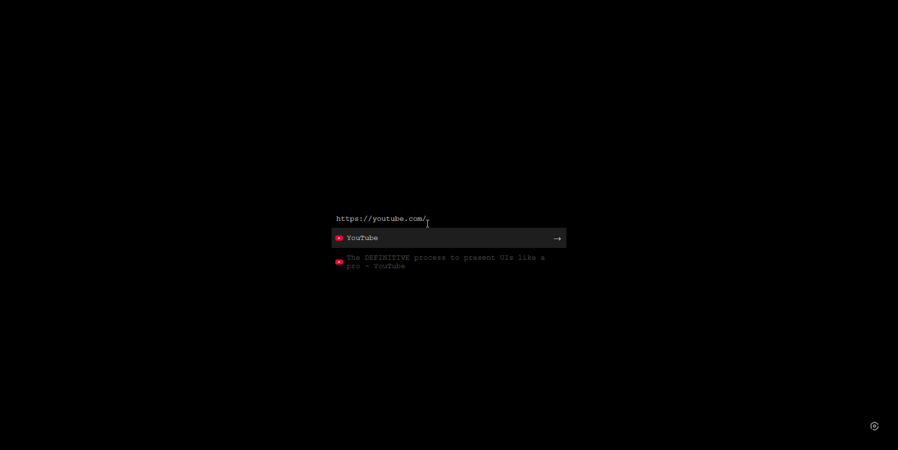
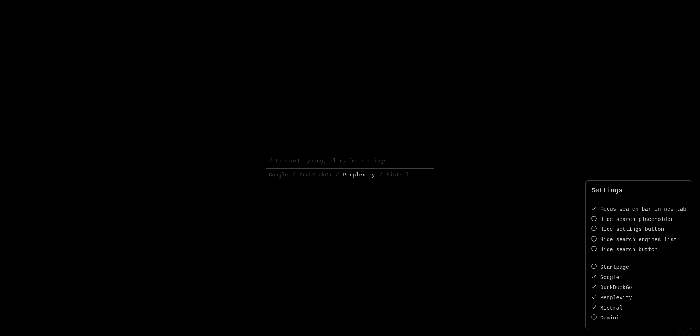

# Min Tab

A minimalist Chrome extension that replaces your new tab page with a clean, dark interface focused on search functionality.

## Screenshots  








## Features

- **Clean Design**: Minimalist black interface with subtle animations
- **Multi-Search Engine Support**: Startpage, Google, DuckDuckGo, Perplexity, Mistral, and Gemini
- **Configurable Engines**: Show/hide engines and remember your choices
- **Smart Suggestions**: Top Sites + History suggestions with favicons (up to 6 results)
- **URL Detection**: Automatically navigate to URLs when entered directly
- **Keyboard Navigation & Shortcuts**: Arrows to navigate, `/` to focus input, `Alt+S` to toggle settings, `Esc` to close
- **Focus Management**: Optional auto-focus on load
- **Loading Indicators**: Visual feedback when navigating to suggestions
- **Accessibility**: Screen reader friendly with proper ARIA labels

## Installation

### From Source
1. Clone or download this repository
2. Open Chrome and navigate to `chrome://extensions/`
3. Enable "Developer mode" in the top right
4. Click "Load unpacked" and select the extension folder
5. The extension will automatically replace your new tab page

## Usage

### Search
- Type your query in the search box
- Press Enter or click the search icon to search
- Enter a URL directly to navigate to it (e.g., `github.com` or `https://example.com`)
- Use arrow keys to navigate through history suggestions

### Search Engines
- Click on any search engine button to switch engines
- The active engine is highlighted
- Use Settings to show/hide which engines appear in the navbar
- Available engines: Startpage (default), Google, DuckDuckGo, Perplexity, Mistral, and Gemini

> Note: `Mistral` and `Gemini` are included but hidden by default. Enable them from Settings → "Show/hide engines".

> Gemini integration uses **Google AI Mode** and requires that you are signed in with a **Google (Gmail) account** in your browser. The extension redirects you to the Google AI interface; if you are not signed in or not eligible, Google will not return a response and you will instead see the message: `"Something went wrong and an AI response wasn't generated."`

### Keyboard Shortcuts
- `/` - Focus the search input from anywhere
- `Alt+S` - Toggle the Settings panel
- `Esc` - Close the Settings panel
- `↓` - Navigate down through suggestions
- `↑` - Navigate up through suggestions or return to search box
- `Enter` - Perform search or select suggestion

## Technical Details

- **Manifest Version**: 3
- **Version**: 2.0
- **Permissions**: `history`, `topSites`
- **Local Storage**: Preferences (active engine, visibility, focus-on-load, placeholder, settings button visibility, search engines visibility, search button visibility)
- **Browser Support**: Chrome (Manifest V3 compatible)

## File Structure

```
├── manifest.json              # Extension configuration
├── new_tab.html              # Main HTML structure
├── style.css                 # Styling and CSS variables
├── assets/
│   ├── data/
│   │   ├── defaults.json     # Default search engines and settings
│   │   └── icons.json        # SVG icons for UI elements
│   ├── images/
│   │   └── icon128.png      # Extension icon
│   ├── screenshots/          # Screenshots for README
│   └── scripts/
│       ├── script.js         # Main initialization script
│       ├── events.js         # Event handlers and listeners
│       ├── keyboardNavigation.js  # Keyboard navigation logic
│       ├── search.js         # Search functionality
│       ├── settings.js       # Settings management
│       ├── suggestions.js    # History and top sites suggestions
│       ├── ui.js             # UI rendering functions
│       └── utils.js          # Utility functions
└── README.md                 # This file
```

## Settings

The Settings panel (gear icon or press `Alt+S`) lets you:

- **Focus search bar on new tab**: Enable/disable auto-focus on load
- **Hide search placeholder**: Show a clean input without placeholder text
- **Hide settings button**: Hide the gear icon (can still access via `Alt+S`)
- **Hide search engines list**: Hide the search engine selector buttons
- **Hide search button**: Disable the search button (Enter key still works)
- **Show/hide engines**: Choose which engines appear in the navbar

## Customization

The extension uses CSS custom properties for easy theming. Key variables in `style.css`:

```css
--color-bg: #000000;           /* Background color */
--color-text: #cccccc;         /* Primary text color */
--color-text-secondary: #555555; /* Secondary text color */
--color-underline: #bbbbbb;    /* Accent color */
```

## Privacy

- No data is collected or transmitted to external servers
- History suggestions are processed locally using Chrome's history API
- Top sites are retrieved locally using Chrome's topSites API
- Search queries are sent directly to your chosen search engine
- Favicons are loaded from Google's favicon service

## License

This project is open source. Free to modify and distribute.

## Contributing

Contributions are welcome! Please feel free to submit issues or pull requests.
