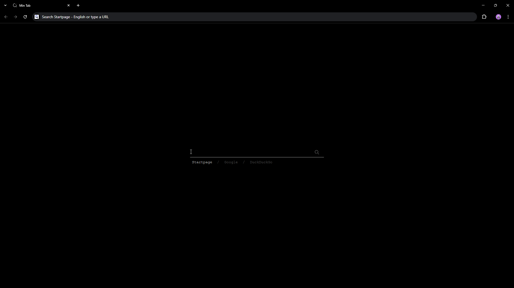

# Min Tab

A minimalist Chrome extension that replaces your new tab page with a clean, dark interface focused on search functionality.

## Screenshot



## Features

- **Clean Design**: Minimalist black interface with subtle animations
- **Multi-Search Engine Support**: Choose between Startpage, Google, and DuckDuckGo
- **Smart Suggestions**: History-based search suggestions with favicons
- **Keyboard Navigation**: Full keyboard support with arrow keys
- **Accessibility**: Screen reader friendly with proper ARIA labels
- **Focus Management**: Automatically focuses search input for immediate typing

## Installation

### From Source
1. Clone or download this repository
2. Open Chrome and navigate to `chrome://extensions/`
3. Enable "Developer mode" in the top right
4. Click "Load unpacked" and select the extension folder
5. The extension will automatically replace your new tab page

## Usage

### Search
- Type your query in the search box
- Press Enter or click the search icon to search
- Use arrow keys to navigate through history suggestions

### Search Engines
- Click on Startpage, Google, or DuckDuckGo to switch search engines
- The active engine is highlighted
- Double-press Enter on a search engine button to search immediately

### Keyboard Shortcuts
- `↓` - Navigate down through suggestions
- `↑` - Navigate up through suggestions or return to search box
- `Enter` - Perform search or select suggestion

## Technical Details

- **Manifest Version**: 3
- **Permissions**: History access for search suggestions
- **Browser Support**: Chrome (Manifest V3 compatible)

## File Structure

```
├── manifest.json       # Extension configuration
├── new_tab.html       # Main HTML structure
├── style.css          # Styling and CSS variables
├── script.js          # JavaScript functionality
├── icon128.png        # Extension icon
└── README.md          # This file
```

## Customization

The extension uses CSS custom properties for easy theming. Key variables in `style.css`:

```css
--color-bg: #000000;           /* Background color */
--color-text: #cccccc;         /* Primary text color */
--color-text-secondary: #555555; /* Secondary text color */
--color-underline: #bbbbbb;    /* Accent color */
```

## Privacy

- No data is collected or transmitted to external servers
- History suggestions are processed locally using Chrome's history API
- Search queries are sent directly to your chosen search engine

## License

This project is open source. Feel free to modify and distribute.

## Contributing

Contributions are welcome! Please feel free to submit issues or pull requests.
