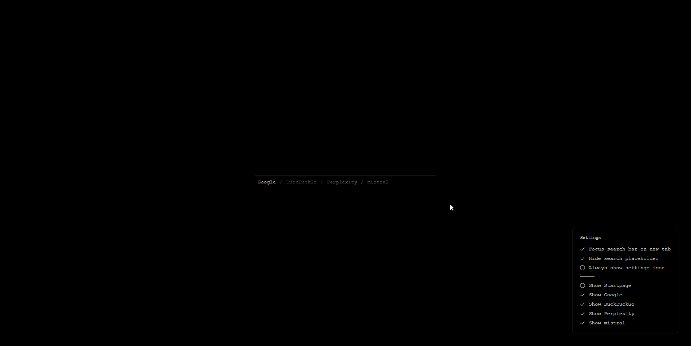
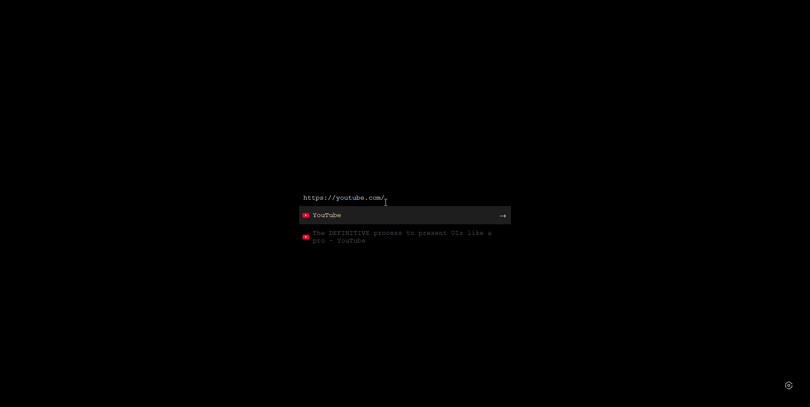

# Min Tab

A minimalist Chrome extension that replaces your new tab page with a clean, dark interface focused on search functionality.

## Screenshot


| Suggestions Overview |  |
|---------------------|--|
|  |  |

## Features

- **Clean Design**: Minimalist black interface with subtle animations
- **Multi-Search Engine Support**: Startpage, Google, DuckDuckGo, Perplexity, and Mistral
- **Configurable Engines**: Show/hide engines and remember your choices
- **Smart Suggestions**: Top Sites + History suggestions with favicons
- **Keyboard Navigation & Shortcuts**: Arrows to navigate, `/` to focus input, `Alt+S` to toggle settings, `Esc` to close
- **Focus Management**: Optional auto-focus on load
- **Accessibility**: Screen reader friendly with proper ARIA labels

## Installation

### From Source
1. Clone or download this repository
2. Open Chrome and navigate to `chrome://extensions/`
3. Enable "Developer mode" in the top right
4. Click "Load unpacked" and select the extension folder
5. The extension will automatically replace your new tab page

## Usage

### Search
- Type your query in the search box
- Press Enter or click the search icon to search
- Use arrow keys to navigate through history suggestions

### Search Engines
- Click on Startpage, Google, DuckDuckGo, Perplexity, or Mistral to switch engines
- The active engine is highlighted
- Double-press Enter on an engine button to search immediately
- Use Settings to show/hide which engines appear

> Note: `Mistral` is included but hidden by default. Enable it from Settings → "Show/hide engines".

### Keyboard Shortcuts
- `/` - Focus the search input from anywhere
- `Alt+S` - Toggle the Settings panel
- `Esc` - Close the Settings panel
- `↓` - Navigate down through suggestions
- `↑` - Navigate up through suggestions or return to search box
- `Enter` - Perform search or select suggestion

## Technical Details

- **Manifest Version**: 3
- **Permissions**: `history`, `topSites`
- **Web Accessible Resources**: `search_engines.json`
- **Local Storage**: Preferences (active engine, visibility, focus-on-load, placeholder, settings icon)
- **Browser Support**: Chrome (Manifest V3 compatible)

## File Structure

```
├── manifest.json       # Extension configuration
├── new_tab.html       # Main HTML structure
├── style.css          # Styling and CSS variables
├── script.js          # JavaScript functionality
├── search_engines.json # Default search engines and visibility
├── icon128.png        # Extension icon
├── image.png          # README screenshot
└── README.md          # This file
```

## Settings

The Settings panel (gear icon or press `Alt+S`) lets you:

- **Focus search bar on new tab**: Enable/disable auto-focus on load
- **Hide search placeholder**: Show a clean input without placeholder text
- **Always show settings icon**: Keep the gear icon visible
- **Show/hide engines**: Choose which engines appear in the navbar

## Customization

The extension uses CSS custom properties for easy theming. Key variables in `style.css`:

```css
--color-bg: #000000;           /* Background color */
--color-text: #cccccc;         /* Primary text color */
--color-text-secondary: #555555; /* Secondary text color */
--color-underline: #bbbbbb;    /* Accent color */
```

## Privacy

- No data is collected or transmitted to external servers
- History suggestions are processed locally using Chrome's history API
- Search queries are sent directly to your chosen search engine

## License

This project is open source. Feel free to modify and distribute.

## Contributing

Contributions are welcome! Please feel free to submit issues or pull requests.
