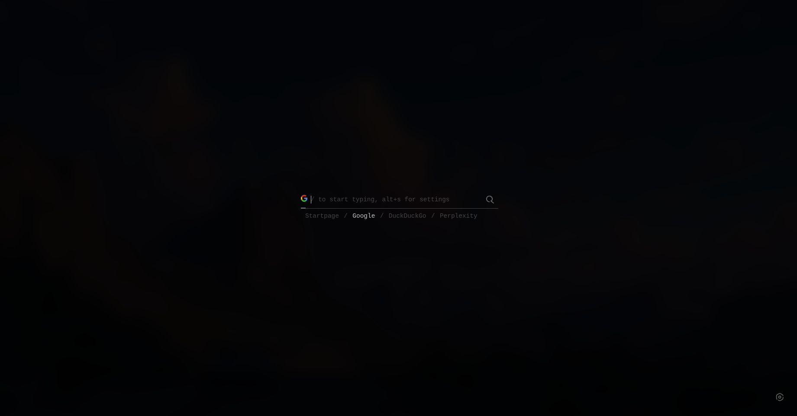
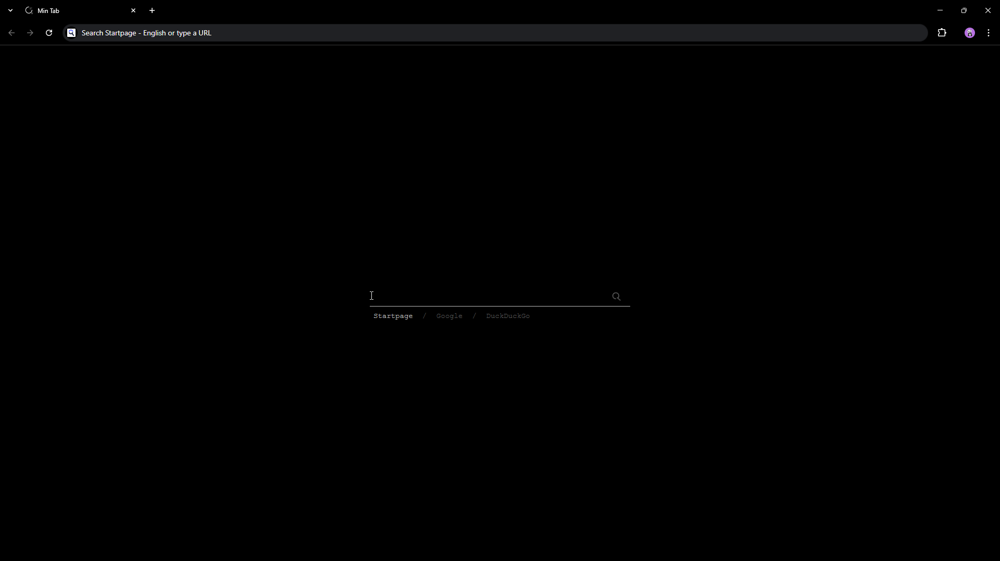
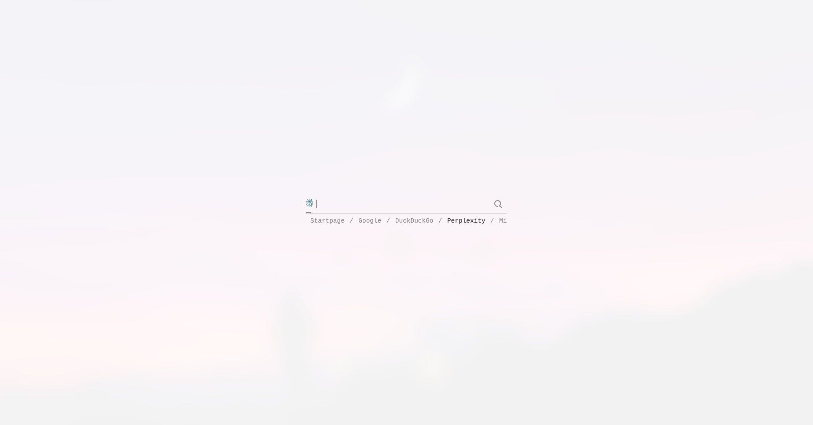
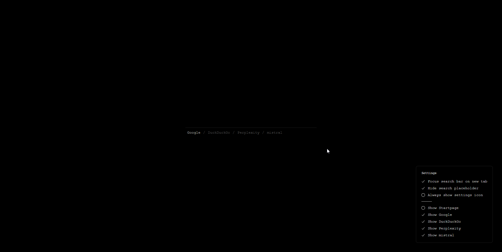
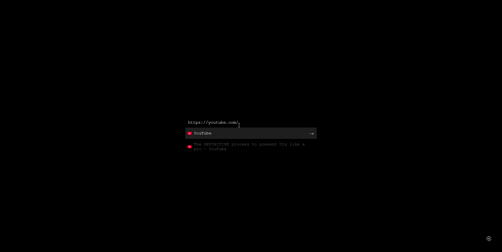
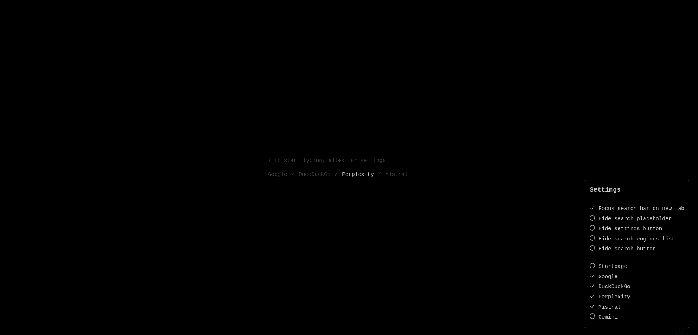

# Min Tab


[](https://addons.mozilla.org/addon/min-tab/)


A minimalist browser extension (Chrome + Firefox) that replaces your new tab page with a clean interface focused on search functionality.
**🎉 Now available on [Mozilla Add-ons](https://addons.mozilla.org/addon/min-tab/)!**



## Table of Contents
- [Screenshots](#screenshots)
- [Features](#features)
- [Installation](#installation)
- [Usage](#usage)
- [Technical Details](#technical-details)
- [File Structure](#file-structure)
- [Settings](#settings)
- [Privacy](#privacy)
- [License](#license)
- [Contributing](#contributing)

## Screenshots  











## Features

- **Clean Design**: Minimalist terminal-like interface using `Courier New` font.
- **Multi-Search Engine Support**: Startpage, Google, DuckDuckGo, Brave, Bing, Perplexity, Mistral, Gemini, and ChatGPT.
- **Configurable Engines**: Show/hide engines and remember your choices.
- **Smart Suggestions**: Combined Top Sites + History suggestions with favicons (up to 6 results).
- **URL Detection**: Automatically navigate to URLs when entered directly (e.g., `github.com` redirects to `https://github.com`).
- **Keyboard Navigation & Shortcuts**: Arrows to navigate, `/` to focus input, `Alt+S` to toggle settings, `Esc` to close it.
- **Auto-Focus Logic**: Optional focus on load and automatic focus on the search input when switching engines.
- **Theme Support**: Dark mode (default), Light mode, and Browser Theme integration (Firefox only).
- **Loading Indicators**: Visual feedback when navigating to suggestions.
- **Horizontal Engine Scrolling**: Use the mouse wheel to scroll through the search engine list.
- **Accessibility**: Screen reader friendly with proper ARIA labels.

## Installation

### Firefox

#### From Mozilla Add-ons (Recommended)
1. Visit [Min Tab on Mozilla Add-ons](https://addons.mozilla.org/addon/min-tab/)
2. Click "Add to Firefox"
3. Confirm the installation prompt
4. Open a new tab to see the new tab page

#### From Source (Developer Mode)
1. Clone or download this repository
2. Open Firefox and navigate to `about:debugging#/runtime/this-firefox`
3. Click "Load Temporary Add-on…"
4. Select the repository's `manifest.json`
5. Open a new tab to see the new tab page

> Note: The temporary add-on install resets when you restart Firefox. If you want a persistent install, use the [Mozilla Add-ons link](https://addons.mozilla.org/addon/min-tab/) above.

### Chrome / Chromium

1. Clone or download this repository
2. Open Chrome and navigate to `chrome://extensions/`
3. Enable "Developer mode" (top right)
4. Click "Load unpacked" and select the extension folder
5. The extension will automatically replace your new tab page

## Usage

### Search
- Type your query in the search box.
- Press **Enter** or click the search icon to search.
- Enter a URL directly to navigate to it (e.g., `github.com`).
- Use **arrow keys** to navigate through history and top sites suggestions.

### Search Engines
- Click on any search engine button to switch engines.
- The active engine is highlighted, and the search input is automatically focused.
- Use the **mouse wheel** to scroll horizontally through the engine list if it exceeds the container width.
- Available engines: Startpage (default), Google, DuckDuckGo, Brave, Bing, Perplexity, Mistral, Gemini, and ChatGPT.

> Note: `Brave`, `Bing`, `Mistral`, `Gemini`, and `ChatGPT` are included but some may be hidden by default. Enable them from Settings → "Show/hide engines".

> Gemini integration uses **Google AI Mode** and requires that you are signed in with a **Google (Gmail) account** in your browser.

### Keyboard Shortcuts
- `/` - Focus the search input from anywhere.
- `Alt+S` - Toggle the Settings panel.
- `Esc` - Close the Settings panel.
- `↓` - Navigate down through suggestions.
- `↑` - Navigate up through suggestions or return to search box.
- `Enter` - Perform search or select suggestion.

## Technical Details

- **Manifest Version**: 3
- **Version**: 2.5
- **Permissions**: `history`, `topSites`
- **Logic**:
    - **URL Detection**: Uses regex to identify domain patterns and prepends `https://`.
    - **Suggestions**: Merges browser Top Sites and History matches, limited to 6 results.
    - **Theme Handling**: Dynamic CSS variable overrides for Light/Dark/Browser themes.
- **Browser Support**: Chrome / Chromium and Firefox (Advanced theme support on Firefox).

## File Structure

```
├── manifest.json              # Extension configuration
├── new_tab.html              # Main HTML structure
├── style.css                 # Styling and CSS variables
├── assets/
│   ├── data/
│   │   ├── defaults.json     # Default search engines and settings
│   │   └── icons.json        # SVG icons for UI elements
│   ├── images/
│   │   └── icon128.png      # Extension icon
│   ├── screenshots/          # Screenshots for README
│   └── scripts/
│       ├── script.js         # Main initialization script
│       ├── events.js         # Event handlers and listeners
│       ├── keyboardNavigation.js  # Keyboard navigation logic
│       ├── search.js         # Search functionality
│       ├── settings.js       # Settings management
│       ├── suggestions.js    # History and top sites suggestions
│       ├── ui.js             # UI rendering functions
│       └── utils.js          # Utility functions
└── README.md                 # This file
```

## Settings

The Settings panel (press `Alt+S` or hover bottom-right to reveal gear icon) lets you:

- **Focus search bar on new tab**: Enable/disable auto-focus on load.
- **Hide search placeholder**: Show a clean input without placeholder text.
- **Hide settings button**: Hide the gear icon (can still access via `Alt+S`).
- **Hide search engines list**: Hide the search engine selector buttons.
- **Hide search button**: Disable the search button (Enter key still works).
- **Hide search engine logo**: Toggle the visibility of the search engine logo next to the input.
- **Switch to light mode**: Toggle between dark and light themes.
- **Use browser theme**: Sync the extension theme with your browser (Firefox only).
- **Show/hide engines**: Choose which engines appear in the navbar.

## Privacy

- No data is collected or transmitted to external servers.
- History suggestions are processed locally using the browser's history API.
- Top sites are retrieved locally using the browser's topSites API.
- Search queries are sent directly to your chosen search engine.
- Favicons are loaded from Google's favicon service (`s2/favicons`).

## License

This project is open source. Free to modify and distribute.

## Contributing

Contributions are welcome! Please feel free to submit issues or pull requests.
